# Dialog Cult (Peter Thiel) — Attendee Roster

This dossier catalogs the known attendees, founders, and invitees of the "Dialog" secret society, co-founded by Peter Thiel and Auren Hoffman in 2006. The data is aggregated from the June 2026 `dialog.org` leak (first surfaced by maia arson crimew) and historic overlaps within the Epstein EFTA files.

*Note: Dialog is an off-the-record, invitation-only gathering described as a "Silicon Valley salon" or tech-focused Bilderberg group. Leaked 2026 retreat topics included "Navigating WWIII," "Build-a-Cult," and featured a matchmaking/status-sorting algorithm.*

## The Democratic Oversight Bypass (Network Graph)

```mermaid
graph TD
    %% Define styles
    classDef elite fill:#2d2d2d,stroke:#ff3333,stroke-width:2px,color:#fff
    classDef proxy fill:#1a1a1a,stroke:#666,stroke-width:1px,color:#fff
    classDef gov fill:#003366,stroke:#66b3ff,stroke-width:2px,color:#fff
    classDef media fill:#336600,stroke:#99ff33,stroke-width:2px,color:#fff
    classDef target fill:#4d0000,stroke:#ff0000,stroke-width:3px,color:#fff

    %% The Core Hub
    Dialog["Dialog Society (Secret Networking Hub)"]:::proxy

    %% The Architects
    Thiel["Peter Thiel (Palantir/Founders Fund)"]:::elite
    Auren["Auren Hoffman (SafeGraph)"]:::elite
    Thiel -->|"Co-founded (2006)"| Dialog
    Auren -->|"Co-founded (2006)"| Dialog

    %% Tech / Infrastructure Nodes
    Lonsdale["Joe Lonsdale (Palantir/8VC)"]:::elite
    Musk["Elon Musk (SpaceX/X)"]:::elite
    Lonsdale -.->|"Attends"| Dialog
    Musk -.->|"Attends"| Dialog

    %% Gov / Military Nodes (The Regulatory Capture)
    Grynkewich["Gen. Alexus Grynkewich (NATO SACEUR)"]:::gov
    Bessent["Scott Bessent (US Treasury Sec)"]:::gov
    Himes["Rep. Jim Himes (House Intel)"]:::gov
    Cruz["Sen. Ted Cruz (R-TX)"]:::gov
    Booker["Sen. Cory Booker (D-NJ)"]:::gov

    Grynkewich -.->|"Off-the-Record Access"| Dialog
    Bessent -.->|"Off-the-Record Access"| Dialog
    Himes -.->|"Off-the-Record Access"| Dialog
    Cruz -.->|"Legislative Coordination"| Dialog
    Booker -.->|"Bipartisan Legitimacy"| Dialog

    %% Academia / Media
    Levin["Jonathan Levin (Stanford Pres.)"]:::media
    Klein["Ezra Klein (NYT/Vox)"]:::media
    Levin -.->|"Academic Credentialing"| Dialog
    Klein -.->|"Narrative Softening"| Dialog

    %% The Epstein Connection
    Epstein["Jeffrey Epstein (Kompromat/Intel)"]:::target
    Randall["Lisa Randall (Harvard)"]:::media

    Randall -->|"Forwarded 2014 Invite"| Epstein
    Epstein -->|"Advised attendance (2012)"| Randall
    Dialog -.->|"Forwarded Invites (2016)"| Epstein
    Thiel -->|"Hosted 2015 Baumé Dinner"| Epstein

    %% Structural Outcome
    Outcome["Democratic Oversight Bypass"]:::target
    Dialog ===>|"Enables"| Outcome
```

## 1. The Founders & Architects
*   **[Peter Thiel](file:///c:/Users/lschi/Downloads/repos/epstein-dataset/investigations/peter_thiel_network_node.md):** Billionaire investor, Palantir co-founder, Founders Fund. Co-founded Dialog in 2006. Source: [Forbes](https://www.forbes.com/sites/thomasbrewster/2026/06/15/peter-thiel-auren-hoffman-dialog-secret-society-leak/).
*   **[Auren Hoffman](file:///c:/Users/lschi/Downloads/repos/epstein-dataset/investigations/auren_hoffman_network_node.md):** SafeGraph and LiveRamp founder. Dialog co-founder and orchestrator of the data/plumbing. Source: [Forbes](https://www.forbes.com/sites/thomasbrewster/2026/06/15/peter-thiel-auren-hoffman-dialog-secret-society-leak/).

## 2. The 2026 Leak Attendees
*A roster of 222 individuals was exposed in the June 2026 data leak for an upcoming August retreat in Dublin, Ireland.*

**Government, Military & Intelligence**
*   **[Gen. Alexus Grynkewich](file:///c:/Users/lschi/Downloads/repos/epstein-dataset/investigations/alexus_grynkewich_network_node.md):** NATO's Supreme Allied Commander Europe. Source: [Esquire](https://www.esquire.com/), [Novara Media](https://novaramedia.com/).
*   **[Scott Bessent](file:///c:/Users/lschi/Downloads/repos/epstein-dataset/investigations/scott_bessent_network_node.md):** U.S. Treasury Secretary. Source: [India Times](https://www.indiatimes.com/), Independent Substack Reports.
*   **[Senator Ted Cruz](file:///c:/Users/lschi/Downloads/repos/epstein-dataset/investigations/ted_cruz_network_node.md):** U.S. Senator (R-TX). Source: [India Times](https://www.indiatimes.com/), [Novara Media](https://novaramedia.com/).
*   **[Senator Cory Booker](file:///c:/Users/lschi/Downloads/repos/epstein-dataset/investigations/cory_booker_network_node.md):** U.S. Senator (D-NJ). Source: [India Times](https://www.indiatimes.com/).
*   **[Rep. Jim Himes](file:///c:/Users/lschi/Downloads/repos/epstein-dataset/investigations/jim_himes_network_node.md):** Ranking Member of the House Intelligence Committee. Source: [WSHU](https://www.wshu.org/).

**Tech Oligarchy & Venture Capital**
*   **[Joe Lonsdale](file:///c:/Users/lschi/Downloads/repos/epstein-dataset/investigations/joe_lonsdale_network_node.md):** Palantir co-founder, 8VC. Source: [WSHU](https://www.wshu.org/).
*   **[Elon Musk](file:///c:/Users/lschi/Downloads/repos/epstein-dataset/investigations/elon_musk_network_node.md):** Tesla, SpaceX, X. Source: [India Times](https://www.indiatimes.com/).

**Academia & Media**
*   **[Jonathan Levin](file:///c:/Users/lschi/Downloads/repos/epstein-dataset/investigations/jonathan_levin_network_node.md):** President of Stanford University. Source: [India Times](https://www.indiatimes.com/).
*   **[Ezra Klein](file:///c:/Users/lschi/Downloads/repos/epstein-dataset/investigations/ezra_klein_network_node.md):** Journalist and podcast host. Source: [India Times](https://www.indiatimes.com/).

## 3. Historic Overlaps (The Epstein Files)
*   **Jeffrey Epstein:** Received forwarded invitations to Dialog retreats in 2012 and 2016. Advised academics on whether the retreats were "worthwhile." Source: [Forbes](https://www.forbes.com/), [Zorro.md](file:///c:/Users/lschi/Downloads/repos/epstein-dataset/zorro.md).
*   **Lisa Randall:** Harvard theoretical physicist. Forwarded the 2014 Sundance Dialog retreat invitation to Epstein in 2012 asking for his blessing/opinion. Source: [Forbes](https://www.forbes.com/).
