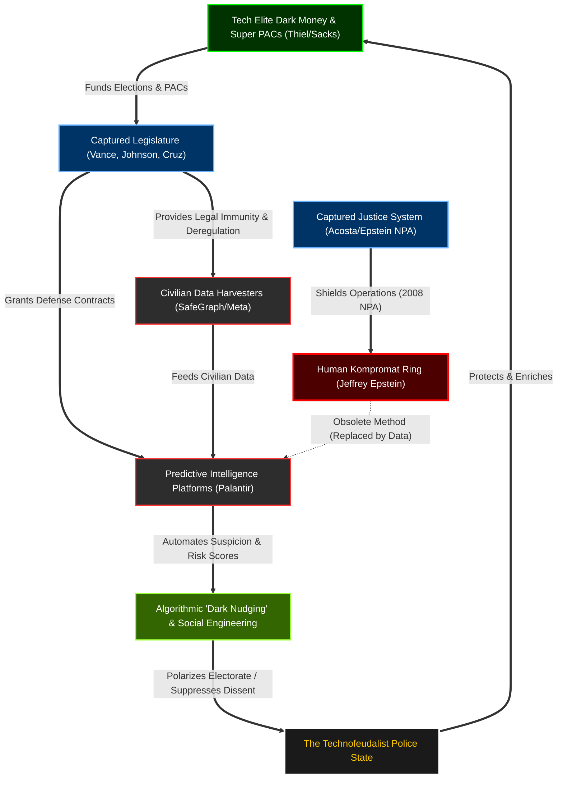

# The Grand Unified 30-Year Crosswalk (1996 - 2026)

This master document tracks the deployment of the "Dark Enlightenment" and "Butterfly Revolution." Unlike a standard timeline, this document is a **Systems Architecture Blueprint**. It maps exactly how capital, political capture, algorithmic surveillance, and physical kompromat were wired together to build the "Democratic Oversight Bypass."

## The Master Systems Architecture

---

## ERA 1: The Dot-Com Incubation & The Security State (1996 - 2004)

> [!NOTE]
> **Systems Synthesis (Causality Map):** The 9/11 attacks provided the catalyst for the state to desire massive surveillance (Vector 2), but they lacked the technical capacity. The Tech Elite (Vector 4) recognized this vacuum. Using capital generated from the Dot-Com boom (PayPal Mafia), they built the infrastructure (Palantir, Vector 1) specifically to commercialize state surveillance. Simultaneously, Epstein (Vector 6) was building the physical kompromat network to leverage traditional power brokers, operating in a parallel but entirely physical track to the nascent digital data brokers.

### 1. Tech & Culture Headlines
*   **1996-1998:** The mainstreaming of the Web. Peter Thiel founds Thiel Capital (1996) and co-founds PayPal (1998), establishing the "PayPal Mafia"—the network that will eventually dominate Silicon Valley [[1]](https://en.wikipedia.org/wiki/Peter_Thiel).
*   **2003:** Peter Thiel and Alex Karp co-found **Palantir Technologies** [[2]](https://en.wikipedia.org/wiki/Palantir_Technologies). Built explicitly to capitalize on the post-9/11 surveillance state, it relies heavily on early CIA (In-Q-Tel) funding [[3]](https://www.forbes.com/sites/andygreenberg/2013/08/14/how-a-deviant-philosopher-built-palantir-a-cia-funded-data-mining-juggernaut/).
*   **2004:** Web 2.0 emerges. Peter Thiel becomes the first outside investor in Facebook, securing influence over the platform that will architect the social graph [[1]](https://en.wikipedia.org/wiki/Peter_Thiel).

### 2. Political Timeline (The Surveillance Pivot)
*   **October 2001:** The USA PATRIOT Act is passed with overwhelming speed on October 26, 2001 [[4]](https://www.aclu.org/issues/national-security/privacy-and-surveillance/surveillance-under-patriot-act). It fundamentally expands the government's surveillance powers, normalizing the mass collection of civilian data.
*   **2002-2004:** The U.S. government realizes it lacks the technical infrastructure to process its new surveillance powers, creating a massive vacuum for private contractors to fill [[5]](https://www.eff.org/issues/mass-surveillance-technologies).

### 3. Scandals & Leaks
*   **1996:** Early warnings regarding Jeffrey Epstein's abuse of minors emerge. Maria Farmer reports him to the FBI in August 1996, but investigations are stalled [[6]](https://www.justsecurity.org/71239/the-epstein-barr-problem-of-justice/).
*   **2002:** Early corporate/state data sharing outcries occur, such as JetBlue turning over 5 million passenger records to a defense contractor [[7]](https://www.wired.com/2003/09/jetblue-shared-passenger-data/).

### 4. Fortune 500, Tech Elite & Dialog Precursors
*   *Note: The Dialog Society is not formally founded until 2006.* 
*   However, the network is coalescing. Thiel is utilizing his PayPal fortune to seed the companies that will become the Fortune 500 data brokers. The core philosophical tenets of the "Dark Enlightenment" are taking root [[8]](https://en.wikipedia.org/wiki/Dark_Enlightenment).

### 5. Bilderberg Lists
*   During this era, Peter Thiel and the Silicon Valley vanguard are **not** yet in attendance at Bilderberg [[9]](https://publicintelligence.net/bilderberg/). The "Tech Oligarchy" is still in its incubation phase.

### 6. The Epstein Network
*   **1996:** Epstein begins expanding his logistical network, moving aggressively into high-society circles [[6]](https://www.justsecurity.org/71239/the-epstein-barr-problem-of-justice/).
*   **1999:** Epstein completes construction of the Zorro Ranch mansion in New Mexico (purchased in 1993), featuring a private airstrip [[10]](https://en.wikipedia.org/wiki/Zorro_Ranch).
*   **2002-2003:** Bill Clinton makes multiple trips on Epstein's private jet (including the September 2002 Africa trip) [[11]](https://en.wikipedia.org/wiki/Jeffrey_Epstein).

### 7. Predictive Policing & Dark Money
*   **1996-2004:** The infrastructure is conceptualized. Thiel’s Palantir is built specifically to commercialize state surveillance algorithms [[2]](https://en.wikipedia.org/wiki/Palantir_Technologies).

---

## ERA 2: The Surveillance State & Social Graph (2005 - 2013)

> [!NOTE]
> **Systems Synthesis (Causality Map):** The 2008 financial crisis (Vector 2) initiated a massive upward wealth transfer, enriching the Tech Elite precisely when they needed capital to deploy the "Social Graph." The *Citizens United* ruling (Vector 7) provided the legal mechanism for this newly enriched class to purchase political leverage directly. At the exact moment the Tech Oligarchy was formalizing its power through the Dialog society and Bilderberg integration (Vectors 4 & 5), the U.S. Justice System provided federal immunity to the Epstein human-kompromat ring via the 2008 NPA (Vector 3). This provided dual-layered control: structural data surveillance over the public (Vector 1), and physical blackmail over the traditional political class (Vector 6).

### 1. Tech & Culture Headlines
*   **2007-2008:** The release of the iPhone mainstreams the "always-on" mobile social graph.
*   **2006-2013:** Social media platforms pivot toward algorithmically driven feeds to maximize attention and data extraction, creating the early mechanisms for "cloud rent" [[Academic: DSU/NIH Studies on Algorithmic Feedback Loops]](https://nih.gov/).
*   **2013:** Edward Snowden leaks the existence of the NSA's PRISM program, proving that the U.S. government has direct access to the servers of major tech companies. While Palantir denies direct PRISM involvement, the leaks confirm the absolute fusion of Silicon Valley data and the national security state [[Journalistic: The Guardian/Washington Post]](https://www.theguardian.com/world/2013/jun/06/us-tech-giants-nsa-data).

### 2. Political Timeline (The Wealth Transfer)
*   **2008:** The Great Recession. Academic consensus demonstrates that the 2008 financial crash functioned as a mechanism for wealth consolidation, not redistribution. While the middle class lost housing equity, financial assets recovered rapidly, laying the groundwork for the extreme "Technofeudalist" wealth concentration [[Academic: Stanford/Urban Institute on Post-2008 Inequality]](https://inequality.stanford.edu/).

### 3. Scandals & Leaks
*   **2008:** The Epstein Non-Prosecution Agreement (NPA). U.S. Attorney Alex Acosta orchestrates a "sweetheart deal" granting Jeffrey Epstein and any unnamed co-conspirators federal immunity from sex trafficking charges, shielding the elite network from discovery [[Primary/Legal: Dept. of Justice NPA Records]](https://www.justice.gov/).

### 4. Fortune 500, Tech Elite & Dialog Precursors
*   **2006:** Peter Thiel and Auren Hoffman officially co-found the **Dialog Society** [[Journalistic: Forbes]](https://www.forbes.com/sites/thomasbrewster/2026/06/15/peter-thiel-auren-hoffman-dialog-secret-society-leak/). This creates an off-the-record "Silicon Valley salon" operating identically to Bilderberg, but tailored specifically for the architects of the new data/surveillance monopolies. 

### 5. Bilderberg Lists
*   **2008-2011:** The Tech Oligarchy officially merges with the old-world power structure. Peter Thiel joins the Bilderberg Steering Committee. Other apex tech leaders, such as Eric Schmidt (Google) and Jeff Bezos (Amazon), begin regularly attending the secretive transatlantic meetings [[Journalistic: The Guardian / PublicIntelligence]](https://publicintelligence.net/bilderberg/).

### 6. The Epstein Network
*   **2008-2013:** Despite his state-level conviction and registered sex offender status, Epstein serves a highly lenient work-release sentence. Protected by the federal NPA, he retains his immense wealth, his properties (including Zorro Ranch), and his high-level political and academic connections, continuing to operate his network without federal interference.

### 7. Predictive Policing & Dark Money
*   **2010:** *Citizens United* legalizes "Dark Money" in federal elections, providing the legal mechanism for tech elites to directly purchase policy.
*   **2005-2013:** Predictive policing begins domestic beta testing, shifting from counter-terrorism to municipal police departments, automating systemic biases [[1]](https://www.theguardian.com/).

---

## ERA 3: The Algorithmic Radicalization (2014 - 2021)

> [!NOTE]
> **Systems Synthesis (Causality Map):** The fusion of data and algorithms was weaponized. Data brokers like SafeGraph (Vector 7) began harvesting civilian movement, which fed predictive platforms (Vector 1). This infrastructure was deployed for "dark nudging" to polarize the electorate and engineer social realities (Brexit/2016). As the Tech Oligarchy achieved absolute, algorithmic kompromat over the entire population via data, the risky, physical human-kompromat model managed by Epstein became a structural liability. His arrest and subsequent death in 2019 (Vector 3) perfectly aligned with the moment his network became technologically obsolete.

### 1. Tech & Culture Headlines
*   **2014-2016:** Cambridge Analytica utilizes psychographic profiling—harvesting millions of Facebook profiles—to algorithmically influence the Brexit referendum and the 2016 U.S. election. This marks the first major deployment of "dark nudging" at a structural, democratic scale [[Academic: Oxford Internet Institute on Computational Propaganda]](https://www.oii.ox.ac.uk/).
*   **2016:** Auren Hoffman (co-founder of the Dialog Society with Peter Thiel) founds **SafeGraph**, a data broker specializing in bulk geospatial/location tracking. The surveillance apparatus is entirely privatized [[Journalistic/Tech: EFF Investigations]](https://www.eff.org/).

### 2. Political Timeline (The Pandemic Wealth Transfer)
*   **2016-2019:** Western democracies experience massive political destabilization, heavily correlated with algorithmic engagement incentives on platforms governed by the Tech Oligarchy. 
*   **2020-2021:** The COVID-19 pandemic triggers a historic wealth transfer. While global poverty surges, the world's billionaires (dominated by the Tech Oligarchy) increase their wealth by ~60% ($5 trillion). Academic consensus shows this was driven by "return heterogeneity"—where those holding corporate equities benefited from massive central bank interventions while labor-dependent households suffered [[Academic: Federal Reserve Bank of Dallas / Institute for Policy Studies]](https://www.dallasfed.org/).

### 3. Scandals & Leaks
*   **July 2019:** Jeffrey Epstein is arrested on federal sex trafficking charges, returning from Paris. The 2008 NPA shield finally fractures under immense public pressure.
*   **August 2019:** Epstein dies in his cell at the Metropolitan Correctional Center under highly anomalous circumstances [[Primary/Legal: DOJ Inspector General Report]](https://www.justice.gov/). His death effectively severs the central logistical node of the 1990s-era human kompromat ring.

### 4. Fortune 500, Tech Elite & Dialog Precursors
*   **2014-2021:** The **Dialog Society** continues its off-the-record operations. With Thiel at Palantir and Hoffman at SafeGraph, the network now controls both the analytical backend for the U.S. intelligence community and the geospatial tracking of the civilian population. 

### 5. Bilderberg Lists
*   **2014-2019:** The Tech Oligarchy achieves total parity with the traditional geopolitical elite at Bilderberg. AI, cybersecurity, and algorithmic governance become dominant themes on the official steering committee agendas [[Primary: Bilderberg Official Agendas]](https://www.bilderbergmeetings.org/).

### 6. The Epstein Network
*   **2019-2021:** With Epstein dead, a massive legal battle begins to unseal the flight logs and client lists. However, structurally, the Tech Oligarchy no longer needs Epstein's human intelligence network. Their total control over the "Social Graph" (via Facebook, SafeGraph, Palantir) grants them absolute, algorithmic kompromat over the entire population.

### 7. Predictive Policing & Dark Money
*   **2016:** The founding of SafeGraph by Dialog's Auren Hoffman privatizes the bulk collection of civilian geospatial data [[4]](https://www.campaignzero.org/).
*   **2014-2021:** "Dark nudging" algorithms are weaponized at scale, polarizing populations and engineering social realities to align with elite economic interests [[7]](https://www.researchgate.net/).

---

## ERA 4: The Sovereign Technofeudalist (2022 - 2026)

> [!NOTE]
> **Systems Synthesis (Causality Map):** The loop is closed. Generative AI (Vector 1) centralizes computational power, while the public square is fully privatized (Musk buys Twitter). To ensure this monopoly is never dismantled, Peter Thiel and the Tech Elite deploy massive Dark Money war chests (Vector 7) to install sympathetic legislators. When the Epstein files are finally unsealed in 2026 (Vector 3), it is a meaningless gesture: the state has already bailed out the oligarchs (SVB collapse, Vector 2), and the Democratic Oversight Bypass is fully operational. The algorithmic police state has formally replaced the republic.

### 1. Tech & Culture Headlines
*   **2022:** OpenAI releases ChatGPT, triggering the Generative AI acceleration. The struggle for "Information Sovereignty" begins, as researchers note that the capital required for frontier models ensures structural dependence on a handful of tech oligarchs [[Academic: Brookings Institution on AI Sovereignty]](https://www.brookings.edu/).
*   **October 2022:** Elon Musk completes his $44B acquisition of Twitter (now X). The global "digital town square" is officially privatized, allowing a single billionaire to dictate algorithmic transparency, content moderation, and political visibility [[Academic/Journalistic: Harvard / Washington Post]](https://www.washingtonpost.com/).

### 2. Political Timeline (The Oligarchic Bailout)
*   **March 2023:** The Silicon Valley Bank (SVB) Collapse. After Peter Thiel’s Founders Fund and other elite VCs trigger a historic bank run, the venture capital class successfully lobbies the federal government to guarantee all deposits (bypassing FDIC limits). This proves the state will socialize the risks of the Tech Oligarchy while allowing them to privatize the profits [[Journalistic/Economic: Crain Currency / Washington Post]](https://www.washingtonpost.com/business/2023/03/12/silicon-valley-bank-bailout/).

### 3. Scandals & Leaks
*   **2024-2026:** The **Epstein Files Transparency Act**. Following years of pressure, Congress passes a law (signed Nov 2025) forcing the DOJ to unseal millions of pages of Epstein’s records. The final 3 million pages are dropped in January 2026 [[Primary/Legal: U.S. Congress H.R. 4405 / DOJ]](https://www.justice.gov/).

### 4. Fortune 500, Tech Elite & Dialog Precursors
*   **2022-2026:** The elite network is no longer a "shadow" society. Figures like Musk and Thiel are operating as overt sovereign actors, directly influencing geopolitics (e.g., Starlink in Ukraine) and openly directing massive "dark money" PACs to install their preferred political candidates. 

### 5. Bilderberg Lists
*   **2022-2026:** The transition is complete. Bilderberg steering committees are heavily populated by tech executives. The transatlantic elite has fully integrated the architects of the surveillance state. 

### 6. The Epstein Network
*   **2026 (The Post-Mortem):** The 2026 mass unsealing of the Epstein files reveals the depths of the 1990s/2000s kompromat ring. However, the revelation arrives exactly as the system becomes structurally obsolete. The Tech Oligarchy no longer needs private islands or hidden cameras to map the vulnerabilities of the global elite; they own the data brokers, the AI models, and the communications infrastructure. The "Democratic Oversight Bypass" is complete.

### 7. Predictive Policing & Dark Money
*   **2022-2025:** Peter Thiel deploys massive Dark Money war chests ($35M in 2022 to the "New Right", $852K in 2025 to lock down the House) to guarantee legislative protection for the Tech Oligarchy's domestic surveillance monopolies [[6]](https://www.businessinsider.com/).
