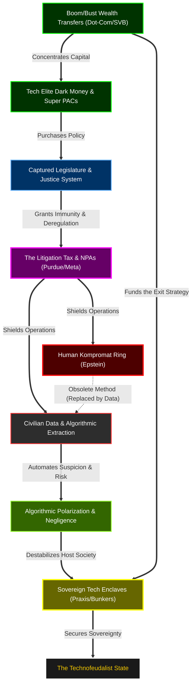

# The Grand Unified 30-Year Crosswalk (1996 - 2026)

This master document tracks the deployment of the "Dark Enlightenment" and "Butterfly Revolution." Unlike a standard timeline, this document is a **Systems Architecture Blueprint**. It maps exactly how capital, political capture, algorithmic surveillance, physical kompromat, and legal impunity were wired together to build the "Democratic Oversight Bypass" and formalize the exit strategy of the Tech Oligarchy.

## The Master Systems Architecture

---

## ERA 1: The Incubation & The Security State (1996 - 2004)

> [!NOTE]
> **Systems Synthesis (Causality Map):** The 9/11 attacks provided the catalyst for the state to desire massive surveillance, but they lacked the technical capacity. The Tech Elite recognized this vacuum. Using capital extracted from the **Dot-Com Bubble and Enron** (the prototypes for socializing risk), they built the infrastructure (Palantir) specifically to commercialize state surveillance. Simultaneously, Epstein was building the physical kompromat network to leverage traditional power brokers, operating in a parallel but entirely physical track to the nascent digital data brokers.

### 1. Financial & Tech Extraction
*   **2000-2001:** The Dot-Com bubble burst and the Enron collapse establish the baseline: oligarchs engineer market manias or systemic fraud, extract the capital at the peak, and allow the public/pension funds to absorb the losses. 
*   **2003:** Peter Thiel and Alex Karp co-found **Palantir Technologies**, relying heavily on CIA (In-Q-Tel) funding.
*   **2004:** Peter Thiel becomes the first outside investor in Facebook, securing influence over the platform that will architect the social graph.

### 2. Legal Impunity & Dark Money
*   The USA PATRIOT Act (2001) fundamentally expands surveillance powers, creating a massive vacuum for private contractors to fill without standard civilian oversight.

### 3. The Epstein Kompromat Network
*   **1996-2003:** Epstein expands his logistical network. Bill Clinton makes multiple trips on Epstein's private jet (including the 2002 Africa trip). Zorro Ranch is completed in New Mexico, serving as a secure physical node.

---

## ERA 2: The Settlement Firewall & Social Graph (2005 - 2013)

> [!NOTE]
> **Systems Synthesis (Causality Map):** The 2008 financial crisis enriched the Tech Elite precisely when they needed capital to deploy the "Social Graph." The *Citizens United* ruling provided the legal mechanism for this class to purchase political leverage directly. At the exact moment the Tech Oligarchy was formalizing its power through the Dialog society, the U.S. Justice System provided federal immunity to the Epstein network via the **2007/2008 NPA**. This established the "Settlement Firewall"—proving that the apex elite do not face justice; they merely negotiate a tax.

### 1. Financial & Tech Extraction
*   **2008:** The Great Recession initiates a massive upward wealth transfer. The Fed Bailouts and ZIRP allow private equity to acquire massive amounts of distressed assets using nearly free money.
*   **2006-2013:** Social media platforms pivot toward algorithmically driven feeds to maximize attention and data extraction.

### 2. Legal Impunity & Dark Money
*   **2007/2008:** The Florida Non-Prosecution Agreement (NPA). The DOJ explicitly grants immunity to Epstein and "any potential co-conspirators," legally sealing the network's liability.
*   **2010:** *Citizens United* legalizes "Dark Money" in federal elections.
*   **2006:** Peter Thiel and Auren Hoffman officially co-found the **Dialog Society**—the off-the-record "Silicon Valley salon" operating identically to Bilderberg.

### 3. Physical Enclaves (Early Ideology)
*   The "Dark Enlightenment" (Neoreaction/NRx) begins to take root, popularizing the concept of "No Voice, Free Exit"—the idea that democracy has failed and the tech elite should simply secede.

---

## ERA 3: Algorithmic Radicalization & The Obsolescence of Kompromat (2014 - 2021)

> [!NOTE]
> **Systems Synthesis (Causality Map):** The fusion of data and algorithms was weaponized. Data brokers like SafeGraph harvested civilian movement, which fed predictive platforms. This infrastructure was deployed for "dark nudging" to polarize the electorate (Brexit/2016). As the Tech Oligarchy achieved absolute, algorithmic kompromat over the entire population via data, the risky, physical human-kompromat model managed by Epstein became a structural liability. The **Purdue/Sackler** opioid settlements proved that immense societal damage could simply be paid off with corporate funds, setting the standard for the Tech Elite's "Litigation Tax."

### 1. Financial & Tech Extraction
*   **2014-2016:** Cambridge Analytica utilizes psychographic profiling to algorithmically influence the Brexit referendum and the 2016 U.S. election.
*   **2016:** Auren Hoffman founds **SafeGraph**, privatizing the bulk collection of civilian geospatial data.
*   **2020-2021:** The COVID-19 pandemic triggers a historic wealth transfer, increasing billionaire wealth by ~60% ($5 trillion).

### 2. Legal Impunity & Dark Money
*   **2015:** The Swiss Bank Program NPA. Edmond de Rothschild (Suisse) SA pays a $45M penalty to the DOJ, officially closing the books on undeclared U.S. accounts, while simultaneously wiring $25M to Epstein's Southern Trust.
*   **2020:** The Purdue/Sackler Archetype is established. The Sacklers agree to a $225M civil penalty regarding the opioid epidemic, dissolving Purdue Pharma while facing no individual criminal liability.
*   **July 2020:** Deutsche Bank pays a $150M penalty (DFS Consent Order) for failing to flag "suspicious" Epstein transactions, socializing the cost of criminal facilitation.

### 3. The Epstein Kompromat Network
*   **July 2019:** Jeffrey Epstein is arrested; the 2008 NPA shield fractures.
*   **August 2019:** Epstein dies in his cell. His death effectively severs the central logistical node of the 1990s-era human kompromat ring—a ring that is no longer necessary due to the absolute control of the Social Graph.

---

## ERA 4: The Sovereign Technofeudalist & The Exit Strategy (2022 - 2026)

> [!NOTE]
> **Systems Synthesis (Causality Map):** The loop is closed. Generative AI centralizes computational power, while the public square is fully privatized (Musk buys Twitter). The Tech Oligarchy now actively causes systemic physical and psychological damage (Tesla autopilot deaths, Meta teen addiction, OpenAI safety failures) and simply pays the resulting class-action "Litigation Tax." Recognizing the societal decay they have engineered, they use their extracted capital to fund "The Exit"—sovereign, extralegal physical enclaves (Praxis, Project Aerie) entirely isolated from the collapsing host nation.

### 1. Financial & Tech Extraction
*   **2022:** OpenAI releases ChatGPT; the struggle for "Information Sovereignty" begins.
*   **October 2022:** Elon Musk acquires Twitter (now X), privatizing the global digital town square.
*   **March 2023:** The Silicon Valley Bank (SVB) Collapse. The venture capital class successfully lobbies the federal government to guarantee all deposits, proving the state will always socialize oligarchic risk.

### 2. Legal Impunity & Systemic Negligence
*   **2022-2026:** The Litigation Tax is formalized.
    *   **Meta:** Hit with a $6M verdict (March 2026) and $9M settlement (May 2026) for addictive algorithmic design targeting youth.
    *   **Tesla:** Hit with a $243M verdict (August 2025) for fatal Autopilot negligence.
    *   **OpenAI:** Sued by the state of Florida (June 2026) for safety negligence and suppressing internal warnings.
    *   **Amazon:** Settles a 2026 class action for illegally soliciting family medical histories to algorithmically predict future worker injuries.
*   **July 2023:** Leon Black wires $62.5 million to the U.S. Virgin Islands to resolve their probe into his relationship with Epstein without admitting liability, preventing criminal discovery.

### 3. Physical Enclaves (The Exit)
*   **2022-2026:** Balaji Srinivasan publishes "The Network State." The Tech Elite aggressively fund Praxis (a Mediterranean crypto-city outside Western jurisdiction) and Project Aerie (domestic, luxury blast-proof bunker communities). The "Exit" from the democratic host is physically underway.

### 4. The Kompromat Post-Mortem
*   **January 2026:** The Epstein Files Transparency Act forces the unsealing of the final 3 million pages of records. The revelation arrives exactly as the system becomes structurally obsolete. The Tech Oligarchy no longer needs private islands to map vulnerabilities; they own the data brokers, the AI models, the communications infrastructure, and the bunkers. The "Democratic Oversight Bypass" is complete.
