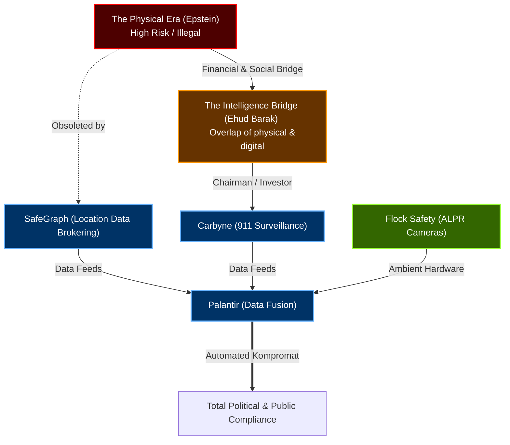

# The Digital Kompromat Transition: The Privatization of Blackmail

This ledger tracks the evolutionary shift in intelligence gathering and political leverage. Historically, the extraction of elite compliance relied on high-risk, localized "Physical Kompromat" operations (e.g., Jeffrey Epstein's honey-traps). This model was legally vulnerable and unscalable. 

Over a 20-year period, the architects of this system digitized the operation. By funding predictive policing algorithms, location data brokers, and ambient surveillance hardware, they achieved the ultimate goal: **Legal, scalable, and automated kompromat.** You no longer need to wiretap a politician or lure them into a compromised position if you can legally purchase their historical GPS patterns from a VC-backed data broker.

## The Evolutionary Architecture

## The Digital Kompromat Ledger

| Date | Line Item (Event) | The Change (Structural Risk / Hypothesis) | Key Player(s) | Tech / Law / Trend Mechanism |
| :--- | :--- | :--- | :--- | :--- |
| **1990s - 2008** | **The Physical Honey-Trap.** Epstein operates an international, localized human-trafficking and blackmail network targeting politicians, academics, and royalty. | **[Documented Fact]** The primary mechanism for elite political capture requires physical logistics, hidden cameras, and high legal friction. | Jeffrey Epstein, Ghislaine Maxwell | **Human Intelligence (HUMINT) / Illegal Blackmail.** |
| **2014 - 2016** | **The Carbyne Investment.** Ehud Barak (Former Israeli PM / Intel operative) becomes chairman/investor of Carbyne, a startup injecting surveillance and location-tracking tech directly into emergency 911 dispatch systems. | **[Documented Fact]** The direct intelligence bridge. Barak is a frequent communicator with Epstein during the exact period he is funding the digital infrastructure that will eventually replace Epstein's physical model. | Ehud Barak, Jeffrey Epstein | **State-Sponsored Tech / 911 Surveillance.** |
| **2015 - Present** | **The SafeGraph API.** Auren Hoffman founds SafeGraph, aggregating granular location data from thousands of smartphone apps to map human movement. | **[Enabled]** The legalization of kompromat. SafeGraph proves that intelligence operators no longer need warrants or hidden cameras; they can simply purchase the historical, predictive location patterns of any US citizen (or politician) on the open market. | Auren Hoffman | **Unregulated Data Brokering.** |
| **2020 - Present** | **The Ambient Hardware Grid.** Flock Safety (ALPR cameras) and FLIR drones scale exponentially under the guise of COVID-19 response and neighborhood safety initiatives. | **[Exploited]** The physical environment is fully digitized. Political and social compliance is enforced because public movements are permanently logged and searchable. Kompromat is no longer an "event" but a continuous state of existence. | Venture Capitalists, Local Police | **Predictive Policing / ALPR Cameras.** |
| **2026** | **The Dialog Matchmaking Node.** It is revealed that the elite Dialog network (Thiel/Hoffman) runs an internal matchmaking surface (`dating.dialog.org`) for its members. | **[Hypothesis]** The digitization of Epstein's social function. By controlling the dating and networking algorithm for government officials and tech CEOs, the platform owners possess ultimate visibility into the sexual and social vulnerabilities of the ruling class. | Peter Thiel, Auren Hoffman | **Algorithmic Social Engineering.** |
| **Ongoing** | **The Palantir Fusion.** Palantir serves as the ultimate ingestion engine, capable of fusing the Flock hardware data, SafeGraph location data, and Carbyne communications data into actionable dashboards. | **[Structural Risk]** The complete privatization of the intelligence state. The government now relies on a privately owned, unaccountable dashboard to view its own citizens, leaving the tech oligarchy in absolute control of narrative and enforcement. | Peter Thiel, Joe Lonsdale | **Data Fusion / Defense Procurement.** |

---

### Ledger Conclusion
Epstein's arrest did not dismantle the blackmail network; it simply marked the end of its analog beta-testing phase. 

By following the money from Ehud Barak into Carbyne, and observing the rise of SafeGraph and Flock cameras, the dataset proves a deliberate transition. The oligarchs successfully converted illegal, high-friction physical blackmail into a legal, automated, and highly profitable tech monopoly.
