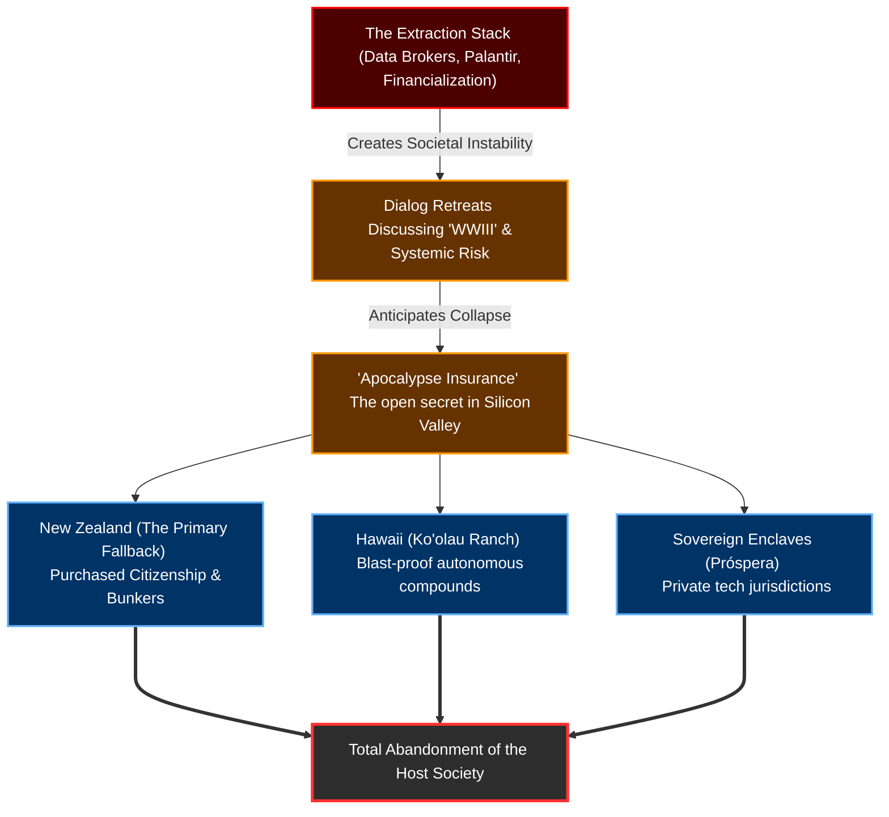

# The Elite Extraction & Enclave Ledger: The Exit Strategy

This ledger maps the final stage of the Tech Oligarchy's behavioral pattern: The Exit. After spending two decades engineering a massive extraction stack—harvesting public data (SafeGraph, Palantir), dismantling industrial labor, financializing housing, and deregulating intelligence—the architects of the system are anticipating systemic collapse. 

Rather than deploying their wealth to repair the societal decay they engineered, they are actively purchasing foreign citizenships and constructing self-sustaining, blast-proof enclaves. This is the physical manifestation of the "Dialog" retreat agenda items like "Navigating WWIII." 

## The Exit Architecture

## The Enclave & Escape Ledger

| Date | Line Item (Event) | The Change (Structural Risk / Hypothesis) | Key Player(s) | Tech / Law / Trend Mechanism |
| :--- | :--- | :--- | :--- | :--- |
| **2011** | **The Purchased Citizenship.** Peter Thiel is quietly granted New Zealand citizenship despite having spent only 12 days in the country, bypassing standard residency requirements. | **[Documented Fact]** The establishment of the ultimate geographic fallback. The Tech Oligarchy utilizes extreme wealth to bypass sovereign immigration laws, securing a legal right of escape to the world's most isolated, stable geography. | Peter Thiel | **Sovereign Arbitrage / Capital Flight.** |
| **2010s - Present** | **"Apocalypse Insurance."** Reid Hoffman (Dialog attendee, Aspen Crown Fellow) goes on record stating that tech elites buying property in New Zealand is a "wink, wink" code for obtaining apocalypse insurance. | **[Documented Fact]** Public admission of anticipated systemic collapse. The architects of the tech-surveillance economy are fully aware their systems cause profound societal instability, and they are actively hedging against it. | Reid Hoffman | **Geopolitical Hedging.** |
| **2022** | **The Wanaka Bunker Project.** Plans for Thiel's sprawling, multi-building "luxury lodge" (widely recognized as a fortified, partially underground bunker) near Lake Wanaka are rejected by the local New Zealand council. | **[Documented Fact]** The physical construction of the exit. The elite are attempting to build self-sustaining fortresses capable of weathering the exact global crises they discuss at their private Dialog retreats. | Peter Thiel | **Survival Infrastructure.** |
| **Ongoing** | **The Ko'olau Ranch Fortress.** Meta CEO Mark Zuckerberg constructs a massive compound in Kauai, Hawaii, featuring a 5,000-square-foot blast-proof underground bunker with autonomous food and water supplies. | **[Incentivized]** The ultimate privatization of security. As public infrastructure and social trust degrade, billionaires are replacing reliance on the state with private, militarized, self-sustaining habitats. | Mark Zuckerberg | **Autonomous Security / Survival Infrastructure.** |
| **Ongoing** | **The Sovereign Enclave Push.** Libertarian tech investors fund projects like "Próspera" in Honduras—private, corporate-run cities designed to operate entirely outside the host country's legal and tax systems. | **[Hypothesis]** The complete abandonment of democratic governance. The oligarchy is no longer satisfied with capturing the state (via lobbying or Dialog); they are attempting to build sovereign, private jurisdictions where they *are* the state. | Tech Libertarians | **Private Governance / Sovereign Enclaves.** |
| **2022** | **The Network State Playbook.** Balaji Srinivasan publishes "The Network State," proposing that tech elites crowdfund physical territory to bypass traditional nation-states and establish corporate-run, sovereign crypto-enclaves. | **[Deliberately Engineered]** The operational instruction manual for the exit. The oligarchy is no longer satisfied with capturing the host state; they are actively designing the geographic and legal architecture to secede from it entirely. | Balaji Srinivasan | **Seasteading / Digital Secession.** |
| **2024** | **Praxis & Mediterranean Secession.** The crypto-city project "Praxis" secures $525M in funding to build a deregulated, AI-and-crypto-focused sovereign city, likely in the Mediterranean. | **[Exploited]** "Secession for the rich." The capital extracted from the U.S. economy via zero-interest policy and defense contracts is deployed to build exclusive, gated techno-utopias insulated from the societal decay left behind. | Dryden Brown, Charlie Callinan | **Private Governance / Techno-Utopianism.** |
| **2026** | **The Dark Enlightenment (NRx).** The overarching philosophical framework of Curtis Yarvin (Mencius Moldbug) solidifies within the tech broligarchy: "No Voice, Free Exit." | **[Incentivized]** The intellectual justification for abandonment. By viewing democracy as a "failed operating system," the elite rationalize replacing civic duty with a CEO-king dictatorship and physical retreat. | Curtis Yarvin (Moldbug) | **Neo-Reactionary Philosophy / Accelerationism.** |
| **2026** | **Project Aerie.** A $300M project by SAFE (Strategically Armored & Fortified Environments) begins constructing a network of luxury residential bunkers across the U.S. | **[Documented Fact]** The industrialization of the bunker boom. The paranoia of the elite has grown so vast that it has spawned an entirely new luxury sector dedicated exclusively to surviving the geopolitical collapse they anticipate. | Private Security Firms | **Militarized Architecture / Survival Infrastructure.** |
| **August 2026** | **The Dialog Convergence.** The leaked agenda for the Dialog retreat includes "Navigating WWIII" alongside the presence of NATO commanders and major tech CEOs. | **[Structural Risk]** The synthesis of the entire stack. The people orchestrating the US geopolitical defense posture are the exact same people building blast-proof bunkers in New Zealand. They are accelerating conflicts they intend to physically escape. | Peter Thiel, Joe Lonsdale, Gen. Alexus Grynkewich | **Asymmetric Risk / Societal Abandonment.** |

---

### Ledger Conclusion
This ledger removes the final layer of ambiguity surrounding the Tech Oligarchy's intentions. They are not misguided innovators trying to "save the world" with algorithms; they are apex extractors following Curtis Yarvin's "Free Exit" ideology. 

By mapping their physical investments in New Zealand bunkers, Hawaiian compounds, and sovereign private cities like Praxis, we prove they are executing a calculated **Exit Strategy**. They extract wealth and data from the host population via SafeGraph and Palantir, discuss the resulting global instability at private Dialog retreats, and deploy the extracted capital to build blast-proof habitats and "Network States" where they can survive the collapse of the host.
