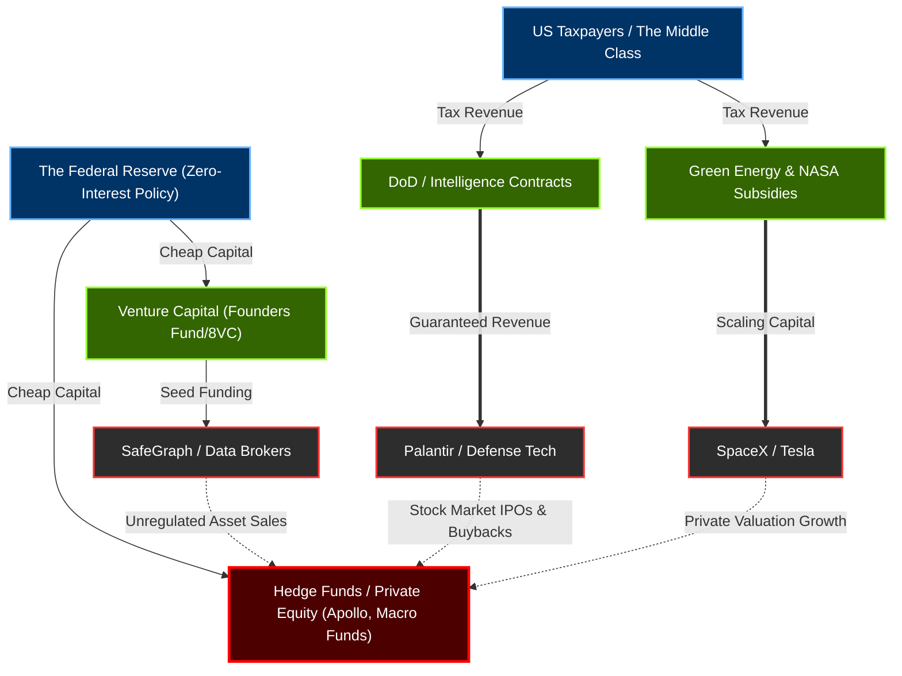

# The Financial Extraction Ledger: VCs, Hedge Funds, Contracts, and Subsidies

This ledger maps the **Economic Engine** of the Oversight Bypass. The myth of the American tech oligarchy relies on the narrative of the "free market genius." In reality, the architectures of American decline (surveillance, space/satellite monopolies, social fragmentation) were heavily funded by public tax dollars via government contracts and subsidies, while the profits were aggregated by private Hedge Funds and Venture Capitalists. 

This table audits exactly how public wealth was extracted into private hands.

## The Economic Capture Flow

## The Financial Extraction Ledger

| Date | Line Item (Event) | The Change (Structural Risk / Hypothesis) | Key Player(s) | Tech / Law / Trend Mechanism |
| :--- | :--- | :--- | :--- | :--- |
| **2003 / 2004** | **Palantir & In-Q-Tel.** Palantir is founded, heavily backed by the CIA's venture capital arm, In-Q-Tel. | **[Documented Fact]** Venture Capitalists leverage public intelligence funds to build a private surveillance monopoly that is then leased back to the government. | Peter Thiel, Joe Lonsdale, Alex Karp | **Government Intelligence Contracts.** |
| **2008 - 2012** | **The Fed Bailouts & ZIRP.** The Federal Reserve initiates quantitative easing and Zero-Interest-Rate Policy following the 2008 crash. | **[Enabled]** The stock market and housing market are artificially inflated by the Fed. Hedge Funds and Private Equity firms acquire massive amounts of distressed housing and local retail using nearly free money. | Leon Black (Apollo), John Paulson | **Central Bank Intervention / Private Equity Rollups.** |
| **2010 - 2020** | **The Subsidy Empire.** Tesla and SpaceX scale operations, heavily reliant on green energy tax credits, emissions trading, and massive NASA/DoD logistics contracts. | **[Documented Fact]** The "Free Market" tech billionaire archetype is exposed as being structurally dependent on public subsidies and guaranteed federal contracts to survive early growth stages. | Elon Musk | **Government Subsidies & Defense Contracts.** |
| **2014 - 2018** | **Hedge Fund Political PACs.** Leon Black and the Epstein-adjacent billionaire network direct millions into political PACs (AIPAC, Turning Point). | **[Incentivized]** Hedge Fund managers utilize the massive profits extracted from the 2008 bailout environment to purchase the specific legislators (e.g., Lindsey Graham) required to deregulate their industries. | Leon Black, Carl Icahn | **Dark Money / Super PACs.** |
| **2015 - Present** | **The Data Broker Loophole.** Auren Hoffman founds SafeGraph, building an unregulated market of location and behavioral data. | **[Exploited]** Because the Fourth Amendment prevents the government from collecting this data directly, federal agencies purchase it from VC-backed data brokers, creating a multibillion-dollar unregulated shadow market. | Auren Hoffman | **Data Brokering / Constitutional Bypass.** |
| **Aug 2026** | **The Treasury Capture.** Macro Hedge Fund manager Scott Bessent is exposed as an attendee of the Dialog network. He is subsequently slated to control the U.S. Treasury. | **[Structural Risk]** The ultimate convergence: A hedge fund market-maker is placed in charge of the Federal tax code, crypto regulation, and sanctions, while socializing privately with the tech oligarchs whose stock prices depend on those regulations. | Scott Bessent, Peter Thiel | **Regulatory Capture / Stock Market Manipulation.** |

---

### Ledger Conclusion
The "Tech Revolution" was primarily a **Financial Arbitrage**. By securing Government Contracts (Palantir) and Subsidies (Musk), Venture Capitalists removed the risk of the free market. By utilizing Zero-Interest Fed money, Hedge Funds bought up the real economy (housing, retail). Finally, by installing Wall Street insiders (Bessent) into the Treasury while meeting in secret (Dialog), they ensured the Stock Market would forever remain insulated from democratic taxation or anti-trust enforcement.
