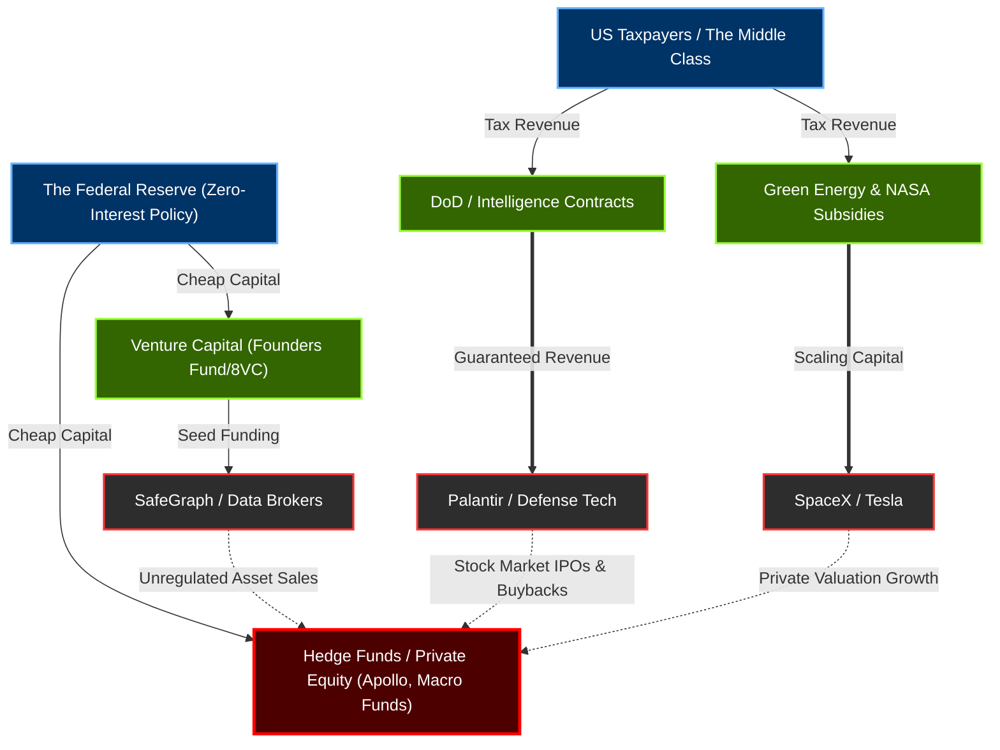

# The Financial Extraction Ledger: VCs, Hedge Funds, Contracts, and Subsidies

This ledger maps the **Economic Engine** of the Oversight Bypass. The myth of the American tech oligarchy relies on the narrative of the "free market genius." In reality, the architectures of American decline (surveillance, space/satellite monopolies, social fragmentation) were heavily funded by public tax dollars via government contracts and subsidies, while the profits were aggregated by private Hedge Funds and Venture Capitalists. 

This table audits exactly how public wealth was extracted into private hands.

## The Economic Capture Flow

## The Financial Extraction Ledger

| Date | Line Item (Event) | The Change (Structural Risk / Hypothesis) | Key Player(s) | Tech / Law / Trend Mechanism |
| :--- | :--- | :--- | :--- | :--- |
| **1980s - Present** | **Systemic Insider Trading.** The prosecution of Galleon Group (Raj Rajaratnam) and the SEC investigations into Epstein at Bear Stearns prove that elite information networks rely on MNPI (Material Non-Public Information) to extract wealth before public awareness. | **[Exploited]** Insider trading is not an anomaly; it is the structural baseline of the elite information network. The oligarchs extract retail wealth by dumping peak-priced assets right before inevitable structural corrections. | Jeffrey Epstein, Bear Stearns, Raj Rajaratnam | **Insider Trading / Information Arbitrage.** |
| **2000** | **The Dot-Com Bubble Burst.** The venture capital and investment banking classes pump the valuations of fundamentally worthless tech companies, executing massive insider sell-offs right before the NASDAQ crash. | **[Deliberately Engineered]** The prototype extraction loop. The elite prove they can engineer market manias, extract the capital at the peak, and allow retail investors and pension funds to absorb the catastrophic losses. | Venture Capitalists, Wall Street | **Market Manipulation / Pump-and-Dump.** |
| **2001** | **The Enron Collapse.** Enron executes massive structural accounting fraud and manipulates California energy markets to artificially inflate revenues before imploding. | **[Documented Fact]** The precursor to modern data/compute extraction. Enron proved that massive, deregulated monopolies will actively engineer societal crises (rolling blackouts) to maximize short-term derivative profits. | Enron Executives, Arthur Andersen | **Accounting Fraud / Energy Market Manipulation.** |
| **2003 / 2004** | **Palantir & In-Q-Tel.** Palantir is founded, heavily backed by the CIA's venture capital arm, In-Q-Tel. | **[Documented Fact]** Venture Capitalists leverage public intelligence funds to build a private surveillance monopoly that is then leased back to the government. | Peter Thiel, Joe Lonsdale, Alex Karp | **Government Intelligence Contracts.** |
| **2008 - 2012** | **The Fed Bailouts & ZIRP.** The Federal Reserve initiates quantitative easing and Zero-Interest-Rate Policy following the 2008 crash. | **[Enabled]** The stock market and housing market are artificially inflated by the Fed. Hedge Funds and Private Equity firms acquire massive amounts of distressed housing and local retail using nearly free money. | Leon Black (Apollo), John Paulson | **Central Bank Intervention / Private Equity Rollups.** |
| **2010 - 2020** | **The Subsidy Empire.** Tesla and SpaceX scale operations, heavily reliant on green energy tax credits, emissions trading, and massive NASA/DoD logistics contracts. | **[Documented Fact]** The "Free Market" tech billionaire archetype is exposed as being structurally dependent on public subsidies and guaranteed federal contracts to survive early growth stages. | Elon Musk | **Government Subsidies & Defense Contracts.** |
| **2014 - 2018** | **Hedge Fund Political PACs.** Leon Black and the Epstein-adjacent billionaire network direct millions into political PACs (AIPAC, Turning Point). | **[Incentivized]** Hedge Fund managers utilize the massive profits extracted from the 2008 bailout environment to purchase the specific legislators (e.g., Lindsey Graham) required to deregulate their industries. | Leon Black, Carl Icahn | **Dark Money / Super PACs.** |
| **2015 - Present** | **The Data Broker Loophole.** Auren Hoffman founds SafeGraph, building an unregulated market of location and behavioral data. | **[Exploited]** Because the Fourth Amendment prevents the government from collecting this data directly, federal agencies purchase it from VC-backed data brokers, creating a multibillion-dollar unregulated shadow market. | Auren Hoffman | **Data Brokering / Constitutional Bypass.** |
| **Aug 2026** | **The Treasury Capture.** Macro Hedge Fund manager Scott Bessent is exposed as an attendee of the Dialog network. He is subsequently slated to control the U.S. Treasury. | **[Structural Risk]** The ultimate convergence: A hedge fund market-maker is placed in charge of the Federal tax code, crypto regulation, and sanctions, while socializing privately with the tech oligarchs whose stock prices depend on those regulations. | Scott Bessent, Peter Thiel | **Regulatory Capture / Stock Market Manipulation.** |
| **2010s - 2024** | **Defense Cloud Consolidation.** The Top 50 "Trillion-Dollar Vanguard" (Microsoft, Amazon AWS, Google) secure massive, guaranteed DoD and DARPA cloud computing contracts (JEDI, JWCC). | **[Exploited]** Big Tech removed free-market risk by anchoring their recurring revenue to the bottomless U.S. defense budget, effectively acting as private infrastructure for the intelligence state. | Microsoft, Amazon, Google | **Government Defense Contracts.** |
| **2015 - Present** | **The Intelligence Bridge (Carbyne).** Former Israeli PM Ehud Barak integrates Israeli military-grade intelligence software (Carbyne/Reporty) into U.S. domestic emergency response (911) systems. | **[Deliberately Engineered]** The privatization of local emergency infrastructure allows foreign intelligence vectors to map and harvest domestic civilian data under the guise of "public safety." | Ehud Barak, Peter Thiel | **Intelligence Contracting / Foreign Espionage.** |
| **2018 - Present** | **Venture Capital Regulatory Capture.** Marc Andreessen (a16z) and elite VC firms deploy massive capital into crypto and AI while aggressively lobbying to prevent regulatory oversight. | **[Incentivized]** By pouring millions into Super PACs, VCs ensure that emerging technologies remain unregulated long enough for early investors to extract peak IPO/token values before structural market collapse. | Marc Andreessen | **Venture Capital lobbying / Deregulation.** |
| **2020 - Present** | **The Autonomous Defense Tier.** The "Surveillance Tier" (Anduril Industries, Clearview AI) scales rapidly via unregulated border surveillance and biometric harvesting contracts. | **[Enabled]** The military-industrial complex shifts from hardware to software, allowing Silicon Valley startups to bypass traditional procurement oversight and build a privatized panopticon. | Palmer Luckey (Anduril), Peter Thiel | **Autonomous Weapons / Biometric Contracting.** |

---

### Ledger Conclusion
The "Tech Revolution" was primarily a **Financial Arbitrage**. By securing Government Contracts (Palantir) and Subsidies (Musk), Venture Capitalists removed the risk of the free market. By utilizing Zero-Interest Fed money, Hedge Funds bought up the real economy (housing, retail). Finally, by installing Wall Street insiders (Bessent) into the Treasury while meeting in secret (Dialog), they ensured the Stock Market would forever remain insulated from democratic taxation or anti-trust enforcement.
