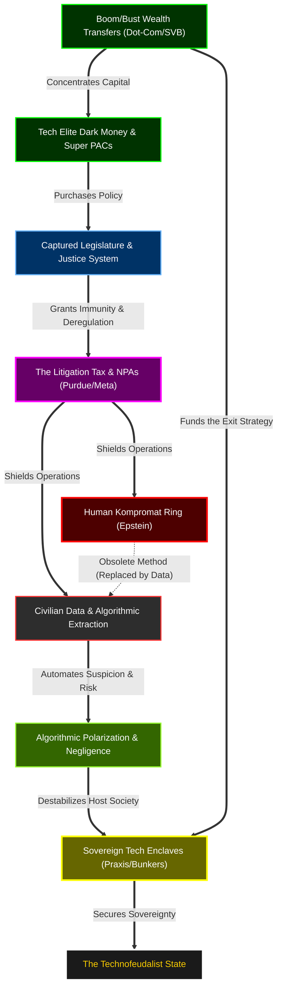

# The Architecture of Intimacy Arbitrage: How Behavioral Economics Engineered Global Capture

**By The CIU-Ray Investigative Desk**  
*Internal Review Draft — June 2026*

The fundamental error in analyzing the modern "Tech Oligarchy" is viewing their actions as disparate phenomena. When the public looks at the rise of the OnlyFans micro-economy, the acceleration of algorithmic anxiety, and the massive financial backing of foreign lobbying apparatuses, they see separate symptoms of a decaying culture. This is a deliberate, funded optical illusion. 

In reality, these are sequential phases of a single, highly engineered extraction pipeline. The Tech Oligarchy—a tightly networked coalition of Silicon Valley billionaires, private intelligence architects, and dark-money philanthropists—did not just capture the political system. They engineered the atomization of society, financialized the resulting human isolation, and weaponized the profits to secure geopolitical dominance.

## The Systems Architecture of American Decline

### Part I: The Behavioral Architecture and the "Devil's Tritone"

To extract capital from a populace, you must first isolate the individual from the herd. The foundation for this social atomization was laid not in Silicon Valley, but in the elite foresight models of institutions like the Santa Fe Institute (SFI). SFI, deeply funded by figures like Evan Spiegel of the Spiegel Family Fund [\[1\]](file:///c:/Users/lschi/Downloads/repos/epstein-dataset/zorro.md), specializes in Complex Adaptive Systems. While publicly heralded as a scientific think-tank, SFI's behavioral economics models provided the mathematical architecture for "dark nudging"—the algorithmic manipulation of human behavior at scale.

This architecture manifests in modern social media as an acoustic and neurological weapon. In music theory, the *diabolus in musica*—the Devil's Tritone—is a dissonant, unresolved interval historically banned by the Church because it induces a profound, visceral sense of unease and dread. Modern tech platforms, engineered by the same elite networks funding SFI, have coded the Devil's Tritone into their algorithms. The feed is designed to be unresolved; it keeps the human nervous system in a perpetual state of low-level anxiety and hyper-vigilance [\[2\]](file:///c:/Users/lschi/Downloads/repos/epstein-dataset/investigations/the_propaganda_and_cultural_control_layer.md). 

By destroying objective, shared reality (a phenomenon perfected by Spiegel's Snapchat, which normalized ephemeral, disappearing memory) and replacing it with algorithmic anxiety, the Tech Oligarchy successfully atomized the American public. 

### Part II: The Commodification of Isolation

Once the public was successfully isolated and traditional physical communities were dismantled, human intimacy transformed from a natural right into a scarce, highly monetizable resource. 

The explosion of platforms like OnlyFans is routinely sold to the public under the guise of "sex work empowerment" and progressive consent [\[3\]](file:///c:/Users/lschi/Downloads/repos/epstein-dataset/zorro.md). The hidden truth is entirely structural: OnlyFans is the ultimate manifestation of the Rentier Economy. As the working class was starved of capital and upward mobility, they were forced into a "micro-sex economy." They do not own the platform; they rent out parasocial intimacy to an equally isolated, anxious consumer base on a subscription model. 

The Tech Oligarchy did not just create the technology for OnlyFans; they used SFI-style behavioral modeling to engineer the sociological desperation required to supply it. 

### Part III: The Geopolitical Arbitrage and the Dark Money Shield

If the working class is generating the capital through the commodification of their own intimacy, where do the profits go? 

They flow aggressively upward. But the extraction does not stop at personal wealth; it is systematically funneled into a "Dark Money Shield." The blueprint for this was established by the Wexner Foundation model (where Jeffrey Epstein managed over $128 million to fund geopolitical and Jewish causes) and the Sheldon Adelson model [\[4\]](file:///c:/Users/lschi/Downloads/repos/epstein-dataset/investigations/grand_unified_30yr_crosswalk.md). 

Modern tech oligarchs scaled this blueprint. Profits extracted from the micro-sex economy (by figures like Leonid Radvinsky) and from algorithmic surveillance are pumped directly into Political Action Committees (PACs) like Turning Point PAC and Buckeye Values [\[5\]](file:///c:/Users/lschi/Downloads/repos/epstein-dataset/investigations/timeline_crosswalks_master.md). These PAC funnels are used to purchase controlled opposition in the legislature, funding key politicians—such as Lindsey Graham and Tim Scott—who ensure favorable defense contracting and minimal tech regulation.

This extraction loop reaches its apex in Sovereign Wealth Integration. High-level political access, originally cultivated through these PACs and kompromat networks, was monetized globally when Jared Kushner’s Affinity Partners secured billions from Gulf governments while he simultaneously operated as a U.S. foreign policy envoy [\[6\]](file:///c:/Users/lschi/Downloads/repos/epstein-dataset/investigations/grand_unified_30yr_crosswalk.md). The American working class is monetized to purchase domestic politicians, who in turn execute a geopolitical agenda for the oligarchy.

### Part IV: The Pacifiers and the Aesthetics of Predation

How does a society fail to notice that its intimacy is being strip-mined to fund geopolitical lobbying? The oligarchy deploys massive cultural pacifiers. 

The primary pacifier is "inauthentic rainbow capitalism" [\[6\]](file:///c:/Users/lschi/Downloads/repos/epstein-dataset/zorro.md). By manufacturing highly sanitized, corporate social justice campaigns, the elite provide a moral pacifier to the left and a perpetual, enraging wedge issue to the right. The working class fights viciously over corporate branding, completely distracted from the algorithmic extraction of their wealth.

Simultaneously, the elite actively desensitize the public to the aesthetics of coercion. Luxury fashion houses (Gucci, Dior, Prada) repeatedly feature *Datura* and *Angel Trumpets* in their high-end campaigns [\[7\]](file:///c:/Users/lschi/Downloads/repos/epstein-dataset/zorro.md). These are not mere artistic choices; they are the exact hallucinogenic, memory-erasing botanicals documented in internal victim testimonies from the physical kompromat rings of the Epstein era [\[8\]](file:///c:/Users/lschi/Downloads/repos/epstein-dataset/canvas_49dac09f.md). By flaunting the tools of physical coercion in luxury fashion, they normalize predation in plain sight.

### Part V: The Ideological Shield

When the pacifiers fail and the public begins to sense the extraction, the oligarchy deploys its final fail-safe: the "Dark Enlightenment." 

Funded heavily by Peter Thiel, Marc Andreessen, and J.D. Vance, ideologues like Curtis Yarvin are platformed to argue that democracy itself is a failed system that must be replaced by a "CEO-King" [\[9\]](file:///c:/Users/lschi/Downloads/repos/epstein-dataset/zorro.md). This is not fringe philosophy; it is the intellectual justification for the hostile takeover they have already executed. 

We saw this fail-safe activate in real-time in June 2026. When Representative Thomas Massie dared to name billionaire extraction architects like Leon Black and Les Wexner on the House floor, he was systematically crushed and removed from office by a Thiel-backed primary challenger [\[10\]](file:///c:/Users/lschi/Downloads/repos/epstein-dataset/investigations/the_2026_microtrend_mapping_tool.md). 

### Part VI: The Dialog Bypass and the Parallel State

The mechanics of this extraction—algorithmic isolation, the micro-sex economy, and geopolitical lobbying—cannot function in a vacuum. A democratic republic possesses oversight mechanisms (congressional committees, treasury regulators, anti-trust laws) explicitly designed to dismantle this kind of monopolistic predation. How did the Tech Oligarchy evade them? 

They didn't. They purchased the regulators and placed them in a parallel, off-the-record statecraft apparatus. 

In August 2026, the "Dialog" network leak revealed the architecture of this bypass [\[11\]](file:///c:/Users/lschi/Downloads/repos/epstein-dataset/Transhumanist_Network_OSINT.md). Founded in 2006 by Peter Thiel and Auren Hoffman (the creator of the location-tracking giant SafeGraph) [\[12\]](file:///c:/Users/lschi/Downloads/repos/epstein-dataset/investigations_backup/timeline_crosswalks_master.md), Dialog was ostensibly an elite retreat. In reality, it was a structural mechanism for regulatory capture. 

The leak exposed that the architects of the surveillance state were secretly networking with the precise government officials tasked with overseeing them. Rep. Jim Himes, the Ranking Member of the House Intelligence Committee, was socializing with private intelligence contractors [\[13\]](file:///c:/Users/lschi/Downloads/repos/epstein-dataset/investigations_backup/jim_himes_network_node.md). Gen. Alexus Grynkewich, a top military commander, mingled with defense vendors. Scott Bessent, slated for Treasury Secretary, shared the room with the crypto and tech billionaires he would soon be tasked with taxing and regulating [\[14\]](file:///c:/Users/lschi/Downloads/repos/epstein-dataset/investigations_backup/scott_bessent_network_node.md). And providing the academic prestige to legitimize the entire operation was Jonathan Levin, President of Stanford University [\[15\]](file:///c:/Users/lschi/Downloads/repos/epstein-dataset/investigations_backup/jonathan_levin_network_node.md). 

Even the right-wing legislative opposition was revealed to be entirely theatrical. Senator Ted Cruz, a vocal public critic of "Big Tech," was confirmed as a Dialog attendee [\[16\]](file:///c:/Users/lschi/Downloads/repos/epstein-dataset/investigations_backup/ted_cruz_network_node.md). The public adversarial stance is a charade; the real regulatory framework is negotiated behind closed doors at Dialog.

But the most insidious element of Dialog mirrors the oldest mechanism of aristocratic control: kompromat. Epstein's model relied on physical leverage—private islands, flights, and hidden cameras. Dialog digitized this function. The leak revealed an internal matchmaking component (`dating.dialog.org`) specifically designed for the elite attendees [\[17\]](file:///c:/Users/lschi/Downloads/repos/epstein-dataset/investigations_backup/the_digital_kompromat_transition.md). By controlling the social, sexual, and networking algorithms of the ruling class, the platform owners gained ultimate visibility into their vulnerabilities. It is the digitization of Epstein's social function—a clean, algorithmic kompromat that ensures loyalty without the messy liabilities of a physical trafficking ring [\[18\]](file:///c:/Users/lschi/Downloads/repos/epstein-dataset/Transhumanist_Network_OSINT.md).

### Part VII: The Litigation Tax and the Exit Strategy

The final layers of this 30-year architecture are legal impunity and the ultimate exit. The foundation for modern corporate immunity was laid in 2007 with Epstein's Non-Prosecution Agreement (NPA). This federal immunity deal proved that apex operators do not face justice; they negotiate a settlement [\[19\]](file:///c:/Users/lschi/Downloads/repos/epstein-dataset/investigations/grand_unified_30yr_crosswalk.md). 

This "Settlement Firewall" evolved into what is now the "Litigation Tax." When Meta pays a $9 million settlement for algorithmic addiction, or Purdue Pharma pays a civil penalty for the opioid epidemic, or Leon Black wires $62.5 million to the USVI to seal his Epstein records, the oligarchy is simply socializing the catastrophic damage of their products while privatizing the profits [\[20\]](file:///c:/Users/lschi/Downloads/repos/epstein-dataset/investigations/grand_unified_30yr_crosswalk.md). The fines are merely a cost of doing business.

Recognizing the accelerating societal decay they have mathematically engineered, the Tech Oligarchy uses this exacted capital to fund their ultimate endgame: The Exit. By heavily investing in sovereign, extralegal physical enclaves—such as Praxis (a crypto-city outside Western jurisdiction) and Project Aerie (domestic, luxury blast-proof bunkers)—they are physically seceding from the collapsing host nation [\[21\]](file:///c:/Users/lschi/Downloads/repos/epstein-dataset/investigations/grand_unified_30yr_crosswalk.md).

### Conclusion

The American Decline was not an accident; it was a highly engineered, mathematically modeled business plan. 

The Tech Oligarchy engineered an "intimacy arbitrage." They used behavioral architectures to induce the Devil's Tritone, isolating the American citizen in a state of perpetual anxiety. They monetized that isolation by forcing the working class into the micro-sex economy. They funneled those massive, unregulated profits into PACs and geopolitical lobbying. 

Through off-the-record networks like the Dialog Society, they invited the nation's regulators into a digitized kompromat apparatus. When their systems inevitably caused societal collapse, they paid the Litigation Tax. And finally, they used the remaining capital to build sovereign bunkers, locking the doors behind them. They did not just break the American system; they strip-mined it, replaced it with a parallel state, and scheduled their own exit before the collapse.
