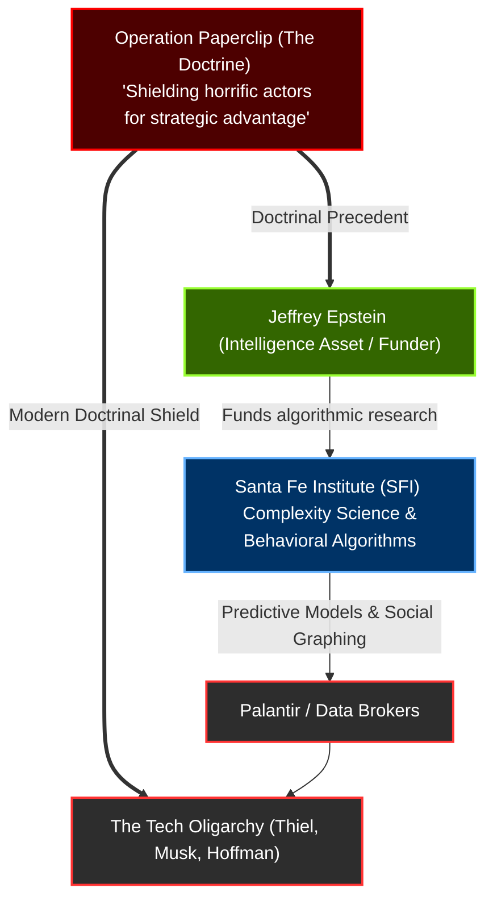

# The Intelligence & Academic Ledger: The Doctrinal Shield

This ledger maps the doctrinal foundation of the Intelligence Community and its intersection with academic world-building. To understand why tech billionaires, data brokers, and intelligence assets (like Jeffrey Epstein) operate outside the bounds of democratic justice, one must track the intelligence doctrine established post-WWII: **Operation Paperclip**.

The state does not enforce justice equally; it trades justice for strategic technological advantage. This ledger tracks how that doctrine was applied to the Nazi scientists, updated for the behavioral algorithms at the Santa Fe Institute (SFI), and weaponized by the modern Tech Oligarchy.

## The Doctrinal Evolution

## The Intelligence & Academic Ledger

| Date | Line Item (Event) | The Change (Structural Risk / Hypothesis) | Key Player(s) | Tech / Law / Trend Mechanism |
| :--- | :--- | :--- | :--- | :--- |
| **1945 - 1950s** | **Operation Paperclip.** The Joint Intelligence Objectives Agency secretly recruits over 1,600 German scientists, engineers, and technicians to the United States. | **[Documented Fact]** Establishes the foundational doctrine of the modern intelligence state: Horrific actors are granted total state shielding and immunity from justice *if* they provide a strategic technological, military, or intelligence advantage. | Joint Intelligence Objectives Agency | **State Immunity / Strategic Exemption.** |
| **1984 - Present** | **The Santa Fe Institute (SFI).** SFI is founded to study "complexity science"—the intersection of biology, economics, and behavioral modeling. | **[Enabled]** SFI becomes the elite academic incubator for predictive algorithms and chaos theory. It serves as the "world-building" laboratory where the theoretical models for algorithmic social manipulation and data extraction are legitimized. | Academic Elites | **Complexity Science / Algorithmic Modeling.** |
| **2000s - 2010s** | **Epstein's Academic Laundering.** Jeffrey Epstein aggressively funds the Santa Fe Institute, Harvard PED, and MIT Media Lab. | **[Exploited]** Epstein leverages the Paperclip doctrine. By funding the exact predictive algorithms and scientific research the intelligence state requires, he purchases academic prestige and deepens his value as an untouchable strategic asset. | Jeffrey Epstein | **Academic Capture / Reputation Laundering.** |
| **2008** | **The Florida NPA.** Epstein receives an unprecedented federal Non-Prosecution Agreement, shielding his entire network from federal prosecution. | **[Documented Fact]** The direct application of the Paperclip doctrine. Epstein is explicitly shielded by federal intelligence ("he belongs to intelligence") because his physical kompromat network and his funding of SFI behavioral algorithms provided a strategic advantage to the ruling class. | Jeffrey Epstein, Alex Acosta | **State Immunity / Intelligence Asset.** |
| **2010s - Present** | **The Rise of Predictive Policing.** Palantir, SafeGraph, and Carbyne deploy massive data-fusion and predictive algorithms across federal and local agencies. | **[Incentivized]** The theoretical behavioral models developed at SFI are fully monetized by the defense contractors. The surveillance state relies on these algorithms to predict and control populations. | Peter Thiel, Joe Lonsdale, Auren Hoffman | **Algorithmic Social Engineering.** |
| **Ongoing** | **The Modern Paperclip Shield.** The Tech Oligarchy operates above anti-trust laws, privacy regulations, and democratic oversight. | **[Hypothesis]** Peter Thiel, Elon Musk, and the Dialog network are shielded by the exact same mechanism as the Paperclip scientists. Because they privately own the critical infrastructure of the intelligence and military state (SpaceX, Starlink, Palantir, SafeGraph), the government grants them total regulatory immunity. | Peter Thiel, Elon Musk | **Strategic Exemption / Private Infrastructure.** |

---

### Ledger Conclusion
There is no mystery as to why Jeffrey Epstein or Peter Thiel operate(d) above the law. It is not an anomaly; it is the stated doctrine of the US Intelligence Community since 1945. **Operation Paperclip** proved that the state will shield monsters if they build rockets. Today, the state shields billionaires and data brokers because they build the algorithmic surveillance grid. The Santa Fe Institute merely served as the academic bridge between the physical blackmail era and the algorithmic era.
