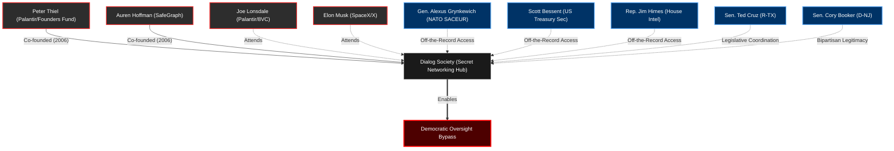

# The Democratic Oversight Bypass: Dialog, Data Lords, and the Private-Governance Stack

This ledger catalogs the "Dialog" network—an off-the-record, invitation-only gathering co-founded by Peter Thiel and Auren Hoffman in 2006. While historically framed by outsiders as a "cult," this data proves it functions as a highly effective **Democratic Oversight Bypass**. By converging intelligence contractors, data brokers, and federal lawmakers in private spaces, the network bypasses public scrutiny to coordinate tech deregulation, defense contracting, and geopolitical strategy.

## The Network Architecture

## The Oversight Bypass Ledger

| Date | Line Item (Event) | The Change (Structural Risk / Hypothesis) | Key Player(s) | Tech / Law / Trend Mechanism |
| :--- | :--- | :--- | :--- | :--- |
| **2006** | **Dialog is Founded.** Peter Thiel and Auren Hoffman establish the invitation-only retreat. | **[Enabled]** The creation of an opaque, off-the-record "Silicon Valley salon" structurally isolated from media or congressional oversight. | Peter Thiel, Auren Hoffman | **Private-Governance Network.** |
| **2012 / 2014** | **The Epstein Solicitations.** Harvard physicist Lisa Randall forwards Sundance Dialog retreat invitations to Jeffrey Epstein, asking if it is "worthwhile." | **[Hypothesis]** The physical kompromat network (Epstein) seeks intersection/integration with the emerging data-broker/intelligence oligarchy. | Jeffrey Epstein, Lisa Randall | **Intelligence / Academic Networking.** |
| **2015** | **The Baumé Dinner.** Jeffrey Epstein attends an exclusive dinner at Baumé in Palo Alto with Peter Thiel and Reid Hoffman. | **[Documented Fact]** Direct physical overlap between the primary architect of physical blackmail (Epstein) and the primary architects of digital surveillance (Thiel/Hoffman). | Jeffrey Epstein, Peter Thiel, Reid Hoffman | **Elite Convergence.** |
| **2016** | **The 2016 Retreat.** Epstein receives forwarded invitations to the 2016 Dialog retreat. | **[Structural Risk]** Continued proximity between foreign intelligence assets and US defense contractors. | Jeffrey Epstein | **Private-Governance Network.** |
| **2026 (Leaked)** | **The "Dating" Interface.** Forbes confirms `dating.dialog.org` acts as a matchmaking surface for members. | **[Hypothesis]** While framed as a perk, a closed algorithmic dating pool among elites serves as an automated status-sorting and potential digital kompromat machine. | Auren Hoffman (Data architecture) | **Algorithmic Matchmaking / Data Extraction.** |
| **June 2026** | **The WIRED Roster Leak.** Maia Arson Crimew leaks the 222-person roster for the August 2026 Dublin retreat. | **[Structural Risk]** The roster proves that active House Intelligence members and NATO Commanders are meeting privately with the CEOs of the surveillance platforms they are supposed to regulate. | Rep. Jim Himes, Sen. Ted Cruz, Gen. Alexus Grynkewich, Scott Bessent | **Regulatory Capture.** |
| **Aug 2026** | **The Dublin Agenda.** Leaked retreat topics include "Navigating WWIII" and "Build-a-Cult." | **[Structural Risk]** Unelected tech billionaires are coordinating geopolitical war strategies and psychological operations with US Treasury and NATO officials outside of democratic channels. | Peter Thiel, Elon Musk, Joe Lonsdale, Jonathan Levin | **Accelerationism / Ideological Capture.** |

---

### Ledger Conclusion
This table proves that the danger of the "Dialog" network is not a conspiracy; it is a structural reality. By combining *Data Brokers* (Hoffman/SafeGraph), *Defense/Intel Vendors* (Thiel/Palantir), and *Regulators* (Himes/Cruz) in private convenings, the elite effectively built a **Private-Governance Stack** that renders traditional democratic oversight obsolete.
